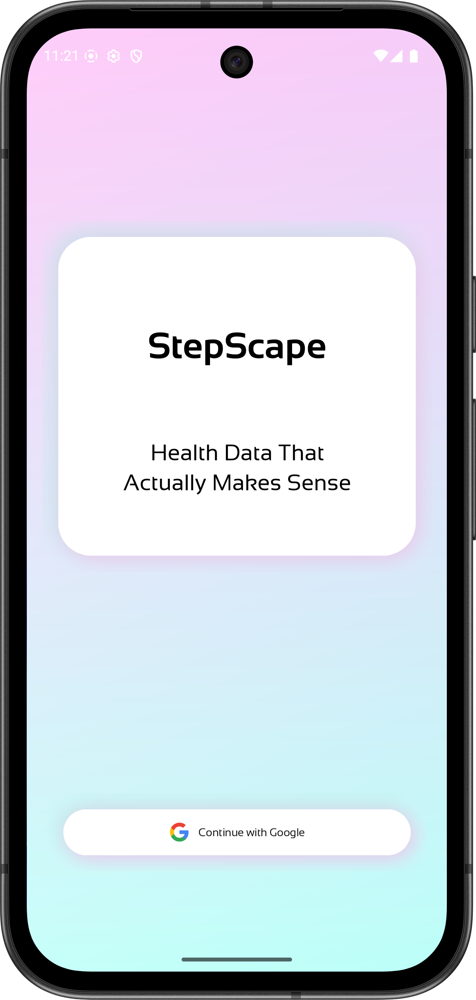
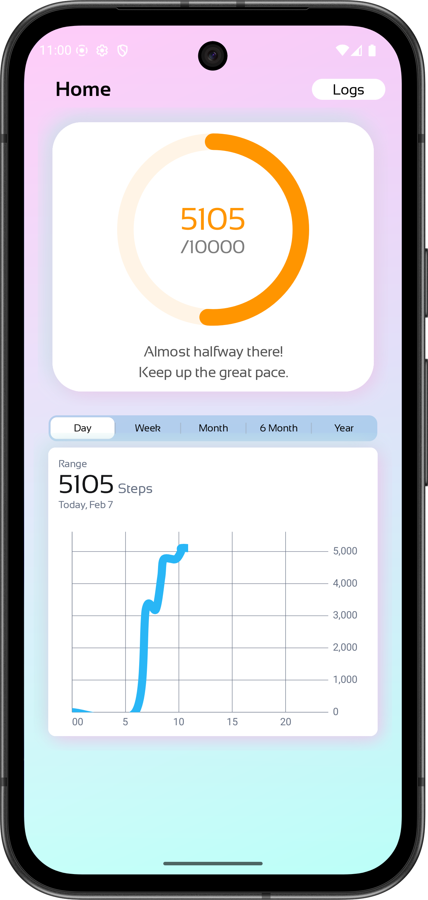
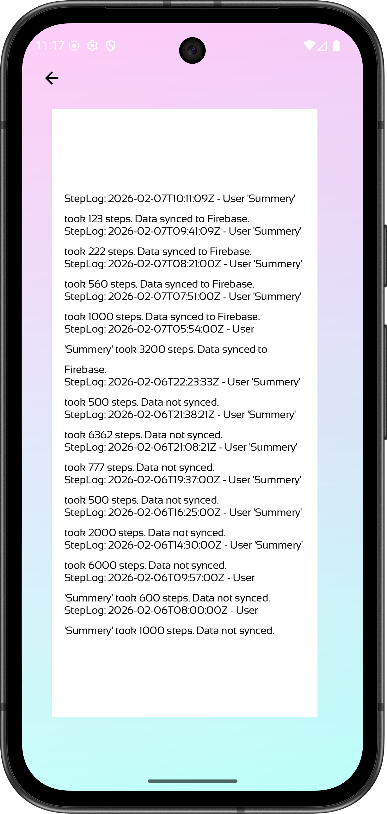

<h1 align="center">🏃 StepScape</h1>

<p align="center">
  <b>Health Data That Actually Makes Sense</b><br/>
  A pixel-perfect daily step tracking app built with modern Android architecture.
</p>

<p align="center">
  
  
  
  
  
  
</p>

---

## Screenshots

| Login | Home Dashboard | Step Logs |
|:---:|:---:|:---:|
|  |  |  |

## Demo


### 🎬 App Walkthrough
https://github.com/samebrave/StepScape/raw/main/screenshots/app.mp4

### 🔥 Firebase Sync
https://github.com/samebrave/StepScape/raw/main/screenshots/firebase.mp4

---

## Overview

**StepScape** is a daily step tracking application that reads real-time step data from **Health Connect**, persists it locally with **Room**, syncs unsynced records to **Firebase Firestore**, and presents everything through a clean, Figma-faithful UI with custom circular progress and interactive charts.

### Key Features

- **Real-Time Step Tracking** — Live integration with Health Connect API; steps fetched automatically on app launch
- **Circular Progress Ring** — Custom `View` with rounded stroke caps and dynamic orange fill toward 10,000-step goal
- **Multi-Period Charts** — Day (hourly cumulative) / Week / Month / 6-Month / Year views powered by MPAndroidChart with smooth cubic Bézier curves
- **Offline-First Sync** — Data saved to Room first, then synced to Firebase; `syncedToFirebase` flag ensures no data loss
- **Google Sign-In** — Firebase Authentication with per-user data isolation (`userId` field on every record)
- **Motivational Text** — Dynamic encouragement messages that update as you approach your daily goal

---

## Architecture

The project strictly follows **MVVM + Repository Pattern** with clear separation of concerns:

```
┌─────────────────────────────────────────────────────┐
│                      View Layer                      │
│  LoginActivity  ·  MainActivity  ·  LogsActivity     │
│  (ViewBinding · XML Layouts · ConstraintLayout)      │
└────────────────────────┬────────────────────────────┘
                         │ observes LiveData
┌────────────────────────▼────────────────────────────┐
│                  ViewModel Layer                      │
│          MainViewModel  ·  LogsViewModel             │
│     (Coroutines · viewModelScope · LiveData)         │
└────────────────────────┬────────────────────────────┘
                         │ calls
┌────────────────────────▼────────────────────────────┐
│                 Repository Layer                     │
│                   StepRepository                     │
│        (Single source of truth orchestrator)         │
└──────┬─────────────────┬───────────────┬────────────┘
       │                 │               │
┌──────▼──────┐  ┌───────▼──────┐  ┌─────▼──────────┐
│  Room (Local)│  │  Firebase    │  │ Health Connect │
│  StepLogDao  │  │  Firestore   │  │ Steps R/W      │
│  StepLog     │  │  FirebaseAuth│  │ Permissions    │
└─────────────┘  └──────────────┘  └────────────────┘
```

### Project Structure

```
app/src/main/java/com/sametyigit/stepscape/
├── StepScapeApplication.kt          # App-level DI (lazy singletons)
├── LoginActivity.kt                 # Google Sign-In → Firebase Auth
├── MainActivity.kt                  # Dashboard: progress ring + chart
├── LogsActivity.kt                  # Step history list
├── data/
│   ├── local/
│   │   ├── StepLog.kt               # Room @Entity
│   │   ├── StepLogDao.kt            # Room @Dao with Flow queries
│   │   └── StepScapeDatabase.kt     # Room database singleton
│   ├── remote/
│   │   └── FirebaseService.kt       # Firestore write operations
│   ├── health/
│   │   └── HealthConnectManager.kt  # HC client, permissions, R/W
│   └── repository/
│       └── StepRepository.kt        # Coordinates local + remote
└── ui/
    ├── CircularProgressView.kt      # Custom circular progress ring
    ├── NeonShadowLayout.kt          # Custom dual-shadow card wrapper
    ├── main/
    │   └── MainViewModel.kt         # Dashboard business logic
    └── logs/
        ├── LogsViewModel.kt         # Logs business logic
        └── LogsAdapter.kt           # RecyclerView ListAdapter + DiffUtil
```

---

## Tech Stack

| Layer | Technology | Purpose |
|-------|-----------|---------|
| **Language** | Kotlin 2.0 | Type-safe, concise, coroutine-native |
| **UI** | XML + ViewBinding | Figma-faithful layouts with ConstraintLayout |
| **Local DB** | Room 2.6 + KSP | Offline persistence with Flow-based reactive queries |
| **Cloud** | Firebase Firestore | Real-time cloud sync for step records |
| **Auth** | Firebase Auth + Google Sign-In | Secure per-user authentication |
| **Health** | Health Connect 1.1 | Native step data read/write |
| **Charts** | MPAndroidChart | Interactive line charts with Bézier curves |
| **Async** | Coroutines + Flow + LiveData | Structured concurrency and reactive streams |
| **Build** | Gradle KTS + Version Catalog | Type-safe, centralized dependency management |

---

## Database Schema

**`step_logs`** table — each row represents one Health Connect step interval:

| Column | Type | Key | Description |
|--------|------|-----|-------------|
| `timestamp` | `Long` | PK | Interval start time (epoch ms) — unique per HC record |
| `date` | `Long` | — | Start-of-day millis for daily grouping |
| `steps` | `Int` | — | Step count for this interval |
| `userId` | `String` | — | Firebase UID — isolates data per user |
| `syncedToFirebase` | `Boolean` | — | `false` by default; set `true` after successful Firestore write |

---

## Data Flow

```
App Launch
   │
   ▼
Health Connect ──read intervals──▶ ViewModel
   │                                  │
   │                           save if new
   │                                  │
   │                                  ▼
   │                             Room (Local)
   │                                  │
   │                          query unsynced
   │                                  │
   │                                  ▼
   │                        Firebase Firestore
   │                                  │
   │                         mark as synced
   │                                  │
   │                                  ▼
   └──────────────────────────▶  UI Updated
                                (LiveData)
```

---

## Setup & Build

### Prerequisites

- **Android Studio** Ladybug or newer
- **JDK 11+**
- **Android device/emulator** with API 28+ (Health Connect requires Android 9)
- **Health Connect** app installed on the target device

### Firebase Configuration

1. Create a project at [Firebase Console](https://console.firebase.google.com)
2. Register an Android app: `com.sametyigit.stepscape`
3. Download `google-services.json` → place in `app/`
4. Enable **Firestore Database** (test mode is fine for evaluation)
5. Enable **Authentication** → Google sign-in provider

### Build & Run

```bash
git clone https://github.com/samebrave/StepScape.git
cd StepScape
```

Open in Android Studio → Sync Gradle → Run on physical device (Health Connect works best on real hardware).

---

## Development Workflow & Tools

This project was built with a **modern AI-augmented development workflow** to maximize speed and quality:

| Tool | How It Was Used |
|------|----------------|
| **Figma + Figma MCP** | Design-to-code pipeline — Figma MCP was used to extract exact dimensions, colors, typography, spacing, and component structure directly from the design file into code, ensuring pixel-perfect UI fidelity |
| **Claude Code (AI Agent)** | Leveraged as an intelligent coding agent for architecture scaffolding, complex logic implementation, code review, and iterative refinement across the full stack |
| **AI-Assisted Development** | Used AI agents throughout the workflow for rapid prototyping, debugging, and ensuring best-practice patterns (MVVM, Repository, coroutine-safe operations) while maintaining full understanding and ownership of every line |

> The combination of Figma MCP for precise design extraction and AI agents for architecture/logic resulted in a high-fidelity, well-architected app delivered in significantly less time — without sacrificing code quality or maintainability.

---

## Challenges & Solutions

| Challenge | Solution |
|-----------|----------|
| Ensuring no duplicate data on repeated app opens | `INSERT … ON CONFLICT IGNORE` via Room's `@Insert(onConflict = IGNORE)` |
| Figma's dual-shadow "neon glow" cards | Custom `NeonShadowLayout` using software-rendered `setShadowLayer()` with two paint passes (teal + pink) |

